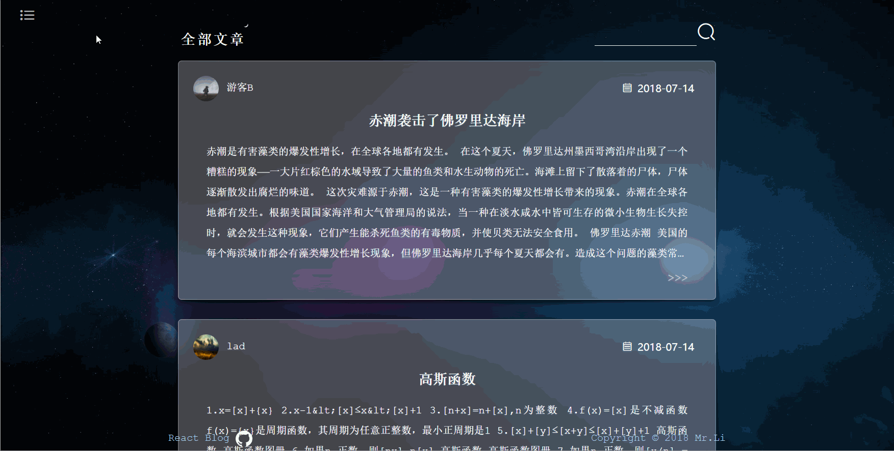
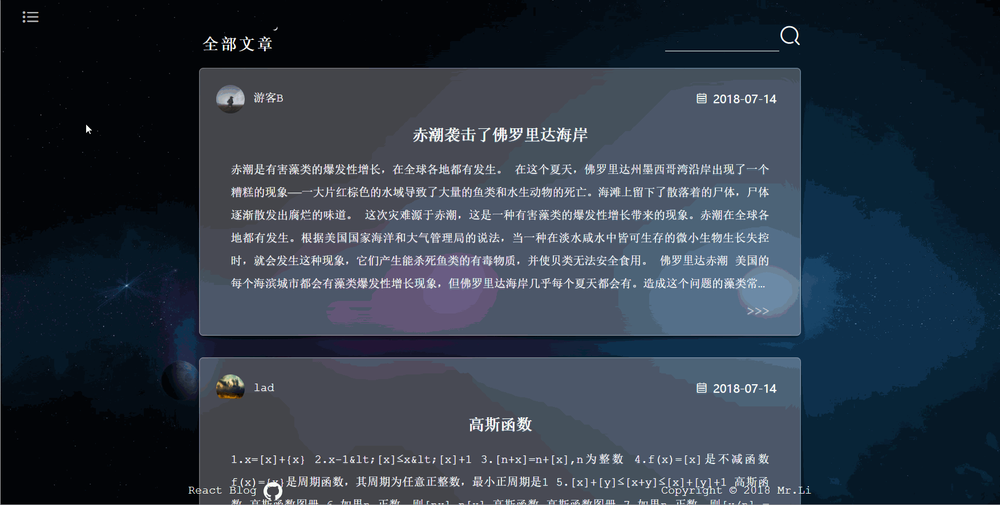
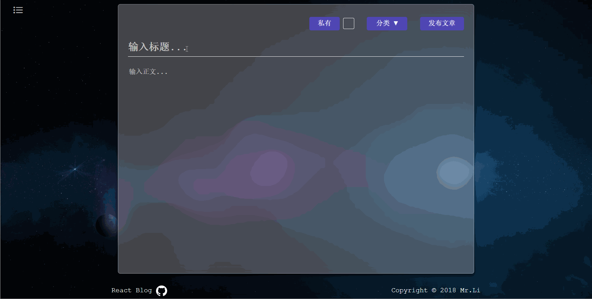
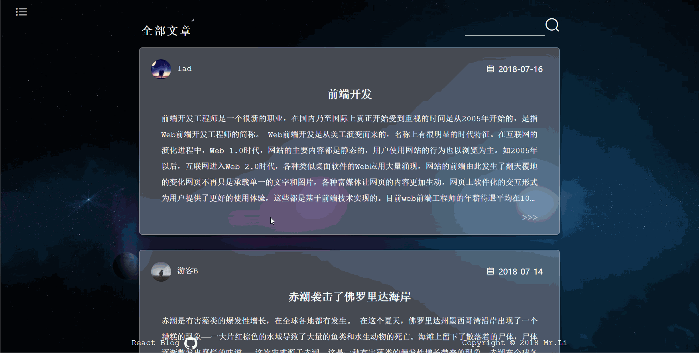
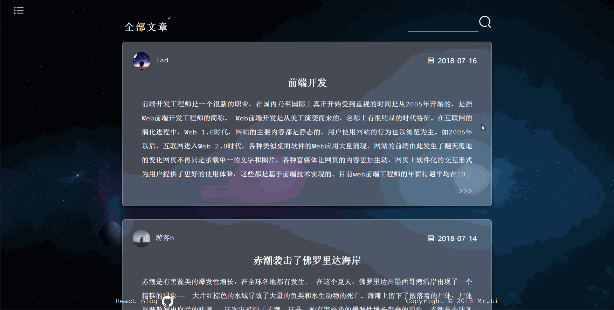

# React-blog

### 前言

> 之前花了一点时间学习了react，但都是做一些简单的 demo，没有系统的做出一个完整的项目，所以这次就使用 React 全家桶来做一个博客系统。

### 项目介绍

> **后端项目接口：[点击此处→](https://github.com/liandao0815/Koa-blog)**

#### 项目功能

- [x] 登录注册
- [x] 身份验证
- [x] 个人信息管理
- [x] 文章类别管理
- [x] 文章分页展示
- [x] 文章增删改查
- [x] 评论系统
- [x] 收藏文章...

#### 技术栈

- [x] **脚手架：** Create-React-App
- [x] **开发框架：** React
- [x] **前端路由：** React-Router
- [x] **状态管理：** Redux
- [x] **动画工具：** React-Transition-Group
- [x] **构建工具：** Webpack
- [x] **CSS模块化方案：** CSS Modules
- [x] **CSS预处理器：** Sass/Scss
- [x] **数据请求：** Axios...

#### 核心代码

- **组件懒加载**

  ```javascript
  export default importComponent => {
    class AsyncComponent extends Component {
      constructor(props) {
        super(props)
  
        this.state = {
          component: null
        }
      }
  
      async componentDidMount() {
        const { default: component } = await importComponent()
  
        this.setState({ component })
      }
  
      render() {
        const C = this.state.component
  
        return C ? <C {...this.props} /> : null
      }
    }
  
    return AsyncComponent
  }
  ```

- **路由权限管理**

  ```javascript
  @connect(state => ({ user: state.user }))
  class AuthorizeRoute extends Component {
    static propTypes = {
      user: PropTypes.object.isRequired
    }
  
    render() {
      const { user, ...rest } = this.props
      return user.isLogin ? <Route {...rest} /> : <Route render={props => <Redirect to="/login" />} />
    }
  }
  
  export default AuthorizeRoute
  ```

- **请求响应配置**

  ```javascript
  const _axios = axios.create({
    baseURL: 'http://localhost:8080/api',
    timeout: 5000
  })
  
  _axios.interceptors.request.use(
    config => {
      const token = window.localStorage ? window.localStorage.getItem('token') : ''
  
      config.headers.Authorization = `Bearer ${token}`
  
      return config
    },
    error => Promise.reject(error)
  )
  
  _axios.interceptors.response.use(
    response => response,
    error => {
      if (error && error.response) {
        switch (error.response.status) {
          case 401:
            error.message = '未授权，请登陆'
            break
          case 404:
            error.message = '找不到指定资源'
            break
          case 500:
            error.message = '服务器内部错误'
            break
          default:
        }
      }
      return Promise.reject(error)
    }
  )
  
  export default _axios
  ```
  

### 项目运行

```bash
# install dependencies
npm install
或者
yarn install

# serve with hot reload at localhost:8080
npm run dev
或者
yarn dev

# build for production with minification
npm run build
或者
yarn build
```

### 运行效果

- **登录**

  

- **首页**

  

- **信息修改**

  

- **发布文章**

  

- **收藏文章**

  

- **搜索文章**

  

- **文章评论**

  

### LICENSE

**MIT**
